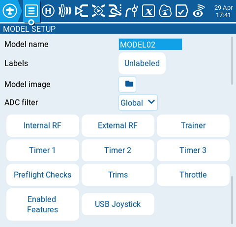

# Model Settings

<figure><figcaption></figcaption></figure>

La pantalla de configuración del modelo **Model Settings** contiene todas las opciones de configuración del mismo. En el borde superior de la pantalla, están los accesos a los diferentes ajustes. La pantalla por defecto que aparece es la que corresponde a los ajustes iniciales[MODEL-SETUP](model-setup/ "mention") screen.&#x20;

The icons at the top of the screen include (in order from left to right):

* [MODEL SETUP](model-setup/)
* [Heli Setup](heli-setup.md) (only visible if EdgeTX is custom compiled with this option.)
* [Flight modes](flight-modes.md)
* [Inputs](inputs-mixes-and-outputs/inputs.md)
* [Mixes](inputs-mixes-and-outputs/mixes.md)
* [Outputs](inputs-mixes-and-outputs/outputs.md)
* [Curves](curves.md)
* [Global Variables](global-variables.md)
* [Logical Switches](logical-switches.md)
* [Special Functions](special-functions.md)
* [Telemetry](telemetry/)
