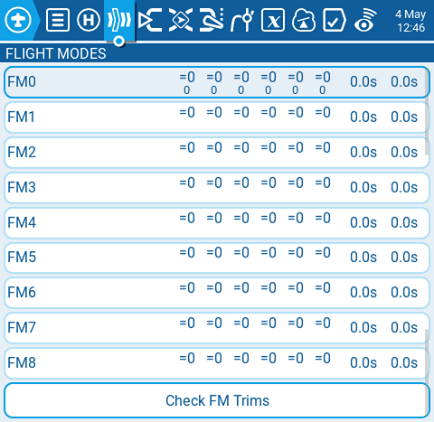
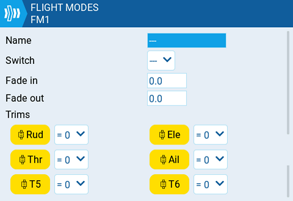

# Flight Modes

<figure><figcaption>
página de modos de vuelo
</figcaption></figure>

En la pantalla Flight modes (modos de vuelo) se pueden configurar diferentes ajustes de los trim (centradores) para cada modo de vuelo. Una vez que se han configurado varios modos de vuelo, pueden ajustarse las configuraciones de los trim (centradores) para cada modo sin afectar, las configuraciones en otros modos ( a menos que se haya configurado para que así sea). Hay 9 modos de vuelo posibles. El modo de vuelo 0 es el modo por defecto.

La pantalla **Flight Modes** es una vista de cada uno de los modos. El modo que aparece destacado, es el activo. Al seleccionar un modo, aparecerá la página de configuración de ese modo.

**Check FM Trims:** Cuando se activa el botón check FM trims, Los trims (centradores) para el modo de vuelo actual, son temporalmente deshabilitados. Esto se utiliza para evaluar el impacto de los ajustes de trim de este modo de vuelo en las salidas.

<figure><figcaption>
Página de configuración de un modo de vuelo
</figcaption></figure>

La pantalla de configuración tiene las siguientes opciones:

**Name (nombre):** El nombre personalizado para cada modo. Si se encuentra configurado, este nombre aparecerá en la parte baja al centro de la pantalla principal entre los trims (centradores).

**Switch:** El interruptor, perilla, telemetría, trim o interruptor lógico que habilitará este modo.

**Fade in:** Cambia en forma gradual el valor del trim al activar este modo. Se debe especificar el tiempo en segundos que demorará en completar el cambio(0.0 - 25.0).

**Fade out:** Cambia en forma gradual el valor del trim al desactivar este modo. Se debe especificar el tiempo en segundos que demorará en completar el cambio(0.0 - 25.0).

**Trims:** Para configurar los trims, se debe seleccionar el que se desea configurar (se tornará el fondo amarillo cuando esté seleccionado). Luego de debe seleccionar el modificador (**=** o **+**) y el modo de vuelo que indicará el valor inicial (**0-8**).

Modifier - Hay dos modificadores posibles **=** y **+.** El modificador **=** copia el mismo valor de trim del modo de vuelo seleccionado. El modificador **+** agrega el valor del modificador seleccionado al valor del modo de vuelo seleccionado.

_Ejemplo 1:_ Si de está configurando FM1 y se ajusta el valor a =0, FM1 tendrá el valor del mismo trim de FM0. En este caso los cambios echos al trim en FM1 también afectarán al trim en FM0 y vice-versa.

_Ejemplo 2:_ Si se está configurando FM1 y se ajusta el valor a +0, FM1 tendrá el mismo valor para el mismo trim  que en FM0 mas cualquier cambio que se haga en FM1, En este caso los cambios echos en el trim en FM1, no afectarán el trim en FM0. Sin embargo, los cambios echos en los valores de trim en FM0, afectarán los valores del trim en FM1.


Si se desactiva el trim (fondo blanco), no será posible ajustar este trim en la pantalla principal.

