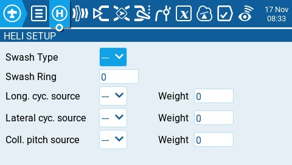

# Heli Setup

La página **Heli Setup (ajustes para helicópteros)** es una página opcional. Se usa mayormente para helicopteros con paso colectivo CCPM en helicópteros con flybar donde el receptor controla directamente los servos del swashplate. La mayoría de los helicópteros sin flybar no necesitan configurar esta página. Las salidas del mezclador CCPM son CYC1, CYC2, y CYC3. 

<figure><figcaption>
página Heli Setup
</figcaption></figure>

Esta página tiene las siguientes opciones:

* **Swash Type** - Tipo de Swashplate que tiene el modelo. Las opciones son **120, 120x, 140, and 90.**
* **Swash Ring** - Ajusta los límites del swashplate. **1** = límite máximo -> **100** o **0** = sin límite.&#x20;
* **Long. cyc. source** - Selecciona el canal a usar para el control longitudinal.
* **Lateral cyc.source** - Selecciona el canal a usar para el control lateral.
* **Coll. pitch source** - Selecciona el canal a usar para el paso colectivo.&#x20;
* **Weight** - Valor porcentual a aplicar para el recorrido de la palanca.&#x20;
