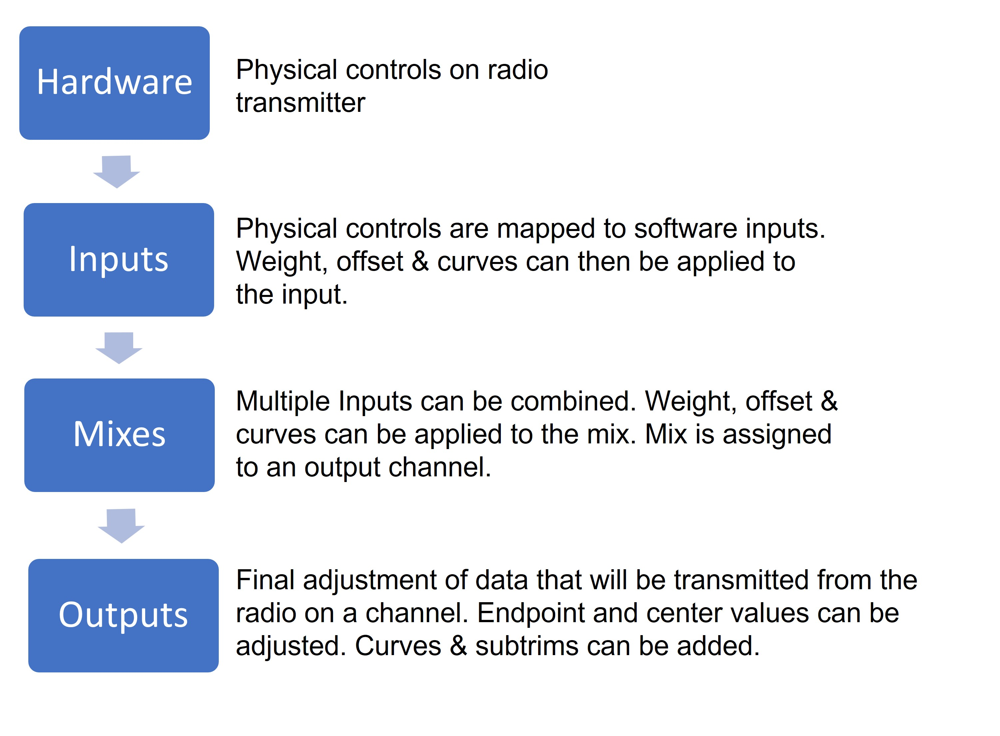
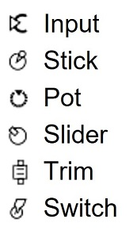

# Inputs, Mixes & Outputs

Para poder soportar muchos tipos diferentes de radio-transmisores, EdgeTX usa un flujo de control de datos genérico que puede ser aplicado a cualquier transmisor.
En este flujo de datos, cualquiera de los controles físicos de la radio, (palancas, interruptores, deslizadores, perillas) puede ser mapeada a una entrada en el software.
Estas entradas pueden asignarse directamente o combinadas con otras entradas en una mezcla simple.
Estas mezclas pueden modificarse aplicando una ponderación (weights), desplazamientos (offsets), y curvas (curves). Para ser asignadas a un canal de salida.
Luego se hacen ajustes finales a los datos de control(incluyendo subtrims (sub-centrados) , curvas, extremos (endpoint) y valores centrales) antes de enviar la señal finalmente al módulo de RF.
El siguiente diagrama da una idea del flujo de la señal. Más detallada información puede verse en las secciones [Inputs (entradas)](inputs.md), [Mixes (mezclas)](mixes.md), y [Outputs (salidas)](outputs.md).

<figure><figcaption>
flujo de control de datos
</figcaption></figure>

EdgeTX usa los siguientes iconos para designar los diferentes tipos de orígenes.&#x20;

<figure><figcaption>
Iconos de orígenes o fuentes
</figcaption></figure>

