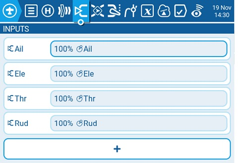
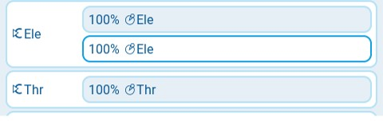
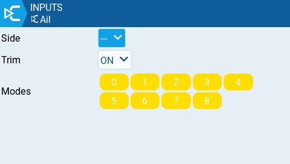

# Inputs

En la pantalla **Inputs (entradas)** de Model Settings es donde se mapean los controles físicos de la radio, (por ejemplo: palancas, deslizadores, perillas) a una entrada del software. Luego de que los controles han sido mapeados, es posible aplicar modificadores a las entradas tales como ponderación (weight), desplazamiento (offset) o una curva que serán aplicados en todos los lugares donde la entrada sea usada. También es posible asignar interruptores como entradas.
EdgeTX mapea automáticamente por defecto, las palancas de control como Alerones, Elevador, Acelerador y Timón. Basandose en el orden por defecto definido en [Radio Setup.](../../radio-settings/radio-setup/)


Los canales de entrada pueden ser ordenados de forma diferente, según los ajustes definidos en la sección [Radio Setup](../../radio-settings/radio-setup/).



La sección de entradas es también llamada comunmente "**Dual Rates"** como fue referida previamente en las primeras versiones de OpenTX.&#x20;


<figure><figcaption>
Pantalla de entradas (Inputs) en Model Settings
</figcaption></figure>

Seleccionando el botón **+** se mostrará una lista de las entradas disponibles para ser configuradas.
Luego de seleccionar una entrada, se abrirá la pantalla de configuración para esta entrada.
Seleccionando una entrada existente aparecerán las siguientes opciones:

* **Edit (editar)** - Abre la página de edición de la configuración para esta entrada.
* **Insert before (insertar antes)** - Inserta una nueva línea antes de esta.
* **Insert after (insertar despues)**- Inserta una nueva línea despues de esta.
* **Copy (copiar)** - Copia esta línea.
* **Move (mover)** - Selecciona esta línea para ser movida. La entrada es movida usando uno de los comandos de pegado (paste).&#x20;
* **Delete (borrar)** - Borra esta línea.
* **Paste before (pegar antes)** - Pega la línea previamente copiada o movida antes de esta línea.
* **Paste after (pegar después)** - Pega la línea previamente copiada o movida después de esta línea.

<figure><figcaption>
Página de configuración de las entradas
</figcaption></figure>

### Input configuration page

La página de configuración de las entradas, permite editar los parámetros de configuración de cada una de las entradas.
A la derecha de los parámetros de configuración, puede verse una representación gráfica de como las opciones de configuración afectarán la forma de la curva de entrada.

* **Input Name (nombre de la entrada)** - Nombre que se le asigna a la entrada. Puede contener cuatro caracteres.
* **Line Name (nombre de la línea)** - Nombre que se le asigna a cada línea individual en la entrada. Pueden mapearse varias entradas físicas a una entrada, agregando una nueva línea bajo la misma entrada.

<figure><figcaption>
Ejemplo de múltiples líneas de entrada bajo una sola entrada
</figcaption></figure>

* **Source (fuente)** - El control físico usado para la entrada. Además de los controles físicos, se puede especificar MAX (siempre retorna 100), cyclics, trims, valores de un canal y más. Moviendo el control físico luego de que source fue seleccionado, se mapeará automáticamente este control a esta entrada.
* **Weight (ponderación)** - Porcentaje del valor de la posición de la palanca a utilizar, (comunmente referido como "rate" o tasa).&#x20;
* **Offset (desplazamiento)** - Un valor agregado o restado al valor de la fuente de entrada.
* **Switch (interruptor)** - El interruptor que activa la linea de entrada. Si no se define un interruptor, entonces estará siempre activa.
* **Curve (curva)** - Especifica el tipo de curva de respuesta a utilizar. Existen las siguientes opciones:
  * **Diff (diferencial)** - Multiplica por un determinado porcentaje % solamente en la mitad inferior o superior del recorrido.
  * **Expo (esponencial)** - El valor de la entrada, se cambia de forma exponencial. Incrementando el % resulta una curva aplanada cerca de la mitad (0). Decrementando el %, aumenta la pendiente de la curva cerca de la mitad (0). Con un % de 0, la pendiente será lineal.
  *   **Func** -

      <table><thead><tr><th width="116">Function</th><th width="575">Slope Behavior</th></tr></thead><tbody><tr><td>---</td><td>The slope will be linear.</td></tr><tr><td>X>0</td><td>The range below the middle (0) is always 0. Above the middle (0), the slope is linear.</td></tr><tr><td>X&#x3C;0</td><td>The range above the middle (0) is always 0. Below the middle (0), the slope is linear.</td></tr><tr><td>|X|</td><td>The range above the middle (0), the reaction is linear. The sign is inverted in the range below the middle (0). The curve draws a V-shaped graph.</td></tr><tr><td>f>0</td><td>The range above the middle (0) is always +100. The range below the middle (0) is always 0. The output value will always be either 0 or +100.</td></tr><tr><td>f&#x3C;0</td><td>The range above the middle (0) is always 0. The range below the middle (0) is always -100. The output value will always be either 0 or -100.</td></tr><tr><td>|f|</td><td>The range above the middle (0) is always +100. The range below the middle (0) is always -100. The output value will always be either +100 or -100.</td></tr></tbody></table>
  * **Cstm** - assigns a custom defined curve. See [Curves](../curves.md) for more information about custom defined curves.


Values for weight, offset and curve % can also be defined by a configured global values Selecting the **GV** button will display a list of configured global values to select from.


When selecting the gear button at the bottom of the screen, the following option window will be displayed.

<figure><figcaption></figcaption></figure>

**Side** - Specifies the input range for which this line setting is valid. If you select **---**, it will be valid in the entire range of Source values. If you select **x>0**, it will be valid in the upper half of the value of Source. If you select **x<0**, it will be valid in the lower half of the value of Source.

**Trim** - Specifies whether or not to include the trim values in this input. Additionally, you can select a different trim to use for this input.

**Modes** - Specifies which flight modes this input is active for.
