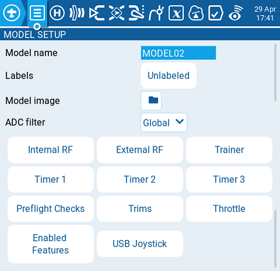

# Model Setup

<figure><figcaption>
Pestaña de ajustes en la pantalla de configuración
</figcaption></figure>

La página **model setup (ajustes del modelo)** es la página por defecto que aparece en la pantalla de configuración del modelo. Es el inicio de la configuración. Contiene los siguientes ajustes:

#### Model name (nombre del modelo)

Se ingresa el nombre del modelo con un máximo de 15 caracteres.

#### Labels (etiquetas)

Aquí es posible asignarle al modelo, una etiqueta de las que se encuentran en la lista de etiquetas ya definida. Por defecto aparece asignada la etiqueta **Unlabeled. (sin etiqueta)** Para más información sobre la creación de etiquetas, ver [select-model.md](../../select-model.md "mention") .

#### Model image (imagen)

Mediante este botón se puede seleccionar una imagen para el modelo, de la lista de imágenes que se encuentra en la carpeta "images" de la tarjeta SD.


Para evitar problemas de rendimiento. La imagen no debe exceder, 192 X 114 pixeles. Para más información sobre los requerimientos de la imagen, ver por favor la parte **Images** de la sección [SD Card (tarjeta SD)](../../radio-settings/sd-card.md).



[https://www.skyraccoon.com/](https://www.skyraccoon.com/) Contiene un gran repositorio de imágenes de libre uso que pueden utilizarse en EdgeTX.


#### ADC Filter (Filtro ADC)

Este botón habilita o no el fltro ADC para este modelo. La opción _**global**_ tomará el valor asignado en la Configuración de la radio, que es activado (_on_) por defecto.


El filtro ADC, suaviza las señales de los canales proporcionales (palancas, potenciómetros, deslizantes), filtrando los movimientos rápidos debidos al ruido de los sistemas electrónicos. Este filtro debe normalmente ser deshabilitado, en los modelos con controladores de vuelo.


