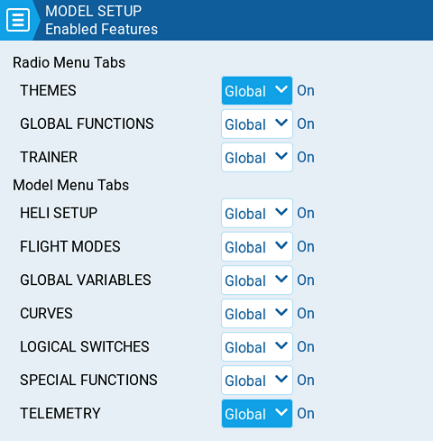

# Enabled Features

<figure><figcaption>
Funciones habilitadas
</figcaption></figure>

La sección **Enabled Features (funciones habilitadas)** de **Model Setup (ajustes del modelo)** permite configurar que pestañas son visibles en la pantalla de configuración del modelo. Se pueden seleccionar las siguientes opciones:

* **Global** - Cuando se selecciona esta opción, la función toma el valor global, configurado en el area **Enabled Features (funciones habilitadas)** de la sección **Radio Setup (ajustes de la radio) **. El valor de la configuración global, se mostrará al lado de la opción.
* **On** - Esta opción, hace que esta función sea visible al cargar este modelo.
* **Off** - Esta opción hace que esta función no sea visible al cargar este modelo.


_**Nota:**_ Cambiando a off una función, solamente oculta la función pero no cambia su valor. Por ejemplo, si se configura una función especial y luego se oculta cambiandola a off, La función especial, seguirá trabajando como fue configurada.

