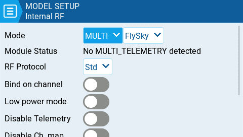
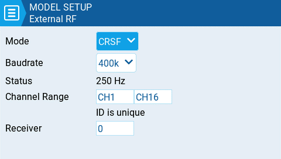

# Internal / External RF

Las configuraciones del módulo de RF interno y del externo trabajan de la misma forma. La única diferencia es que la sección **Internal RF** Es para configurar el módulo de RF interno que viene con la radio y la sección **External RF** es para configurar el módulo que se puede instalar en forma externa.

Si el botón es de color amarillo, significa que el módulo correspondiente, se encuentra activo. Si es de color blanco, el módulo está inactivo.

<figure><figcaption>
Módulo multiprotocolo seleccionado en la configuración interna. "Internal RF"
</figcaption></figure>

 

<figure><figcaption>
Módulo CRSF seleccionado en la configuración externa. "External RF"
</figcaption></figure>

#### Receiver ID (Número de receptor)

El número de receptor (Receiver ID) es un número asignado por el usuario, que es enviado al receptor, durante el enlace. Cada modelo, debe tener un único número de receptor. Solo pueden tener el mismo número, si los receptores usan protocolos distintos. Aparecerá un aviso, para informar si el número es único o si está previamente usado en otro modelo.


Si se usa la radio como mando de juegos conectado a un computador. Deben deshabilitarse tanto el módulo de RF interno como el externo. Esto mejorará el rendimiento.&#x20;


#### Mode Options

* **Off** - RF Module is not used
* **PPM** - Pulse position modulation, used by many generic JR compatible modules.
  * **Telemetry** - No telemetry or MLink
  * **Channel Range** - Channels that will be used.
  * **PPM Frame** – Frame length, pulse length, and polarity of the PPM frame. The frame length is automatically adjusted to the correct value when the number of transmitted channels is changed. However, this automatically assigned value can be manual changed.
* **XJT** -&#x20;
  * **Protocol**- D16, B8, LR2
  * **Channel Range** - Channels that will be used.
  * **Failsafe Mode** - Available in D16 protocol. The receiver will use this setting when the transmitter signal is not being received (signal loss).
    * **Not Set** - failsafe mode is not set.&#x20;
    * **Hold** – The receiver keeps channel values at their last received state from the transmitter.
    * **No pulses** – No PWM pulses are output.
    * **Receiver** – Follows the fail-safe settings configured on the receiver. Follow the instructions that come with the receiver.
    * **Custom** – The receiver changes the channel values to the custom set values.
      * **Custom Set** – Each channel can have its own setting. The options are a value, hold and no pulses.
  * **Receiver Number** -  a user-assigned number for a model that is sent to the receiver when bound
  * **Bind** - This puts the transmitter into bind mode. When in this mode the transmitter will make a chirp sound every 2.5 seconds.
  * **Range** . This puts the transmitter into range check mode. When in this mode, the RSSI value is displayed and a sound is made every 5 seconds.
* **DSM2**
  * **Protocol** - LP45, DSM2, DSMX
  * **Channel Range** - Channels that will be used.
  * **Receiver Number** -  a user-assigned number for a model that is sent to the receiver when bound
  * **Bind** - This puts the transmitter into bind mode. When in this mode the transmitter will make a chirp sound every 2.5 seconds.
  * **Range** . This puts the transmitter into range check mode. When in this mode, the RSSI value is displayed and a sound is made every 5 seconds.
* **CRSF**
  * **Baud Rate** - the speed to which the Transmitter module and the Radio Handset communicate.
  * **Status** - Shows the packet radio configured on the trasmitter module.
  * **Channel Range** - Channels that will be used.
  * **Receiver Number** -  a user-assigned number for a model that is sent to the receiver when bound
* **Multi** - Multiprotocol Module. The configuration options are unique to each selected protocol Configuration options for the multi-protocol module are described here:  [https://www.multi-module.org/using-the-module/protocol-options](https://www.multi-module.org/using-the-module/protocol-options)
* **R9M**
  * **Mode**- FCC, EU, 868MHz, 915 MHZ
  * **Failsafe Mode** - The receiver will use this setting when the transmitter signal is not being received (signal loss).
    * **Not Set** - failsafe mode is not set.&#x20;
    * **Hold** – The receiver keeps channel values at their last received state from the transmitter.
    * **No pulses** – No PWM pulses are output.
    * **Receiver** – Follows the fail-safe settings configured on the receiver. Follow the instructions that come with the receiver.
    * **Custom** – The receiver changes the channel values to the custom set values.
      * **Custom Set** – Each channel can have its own setting. The options are a value, hold and no pulses.
  * **Receiver Number** -  a user-assigned number for a model that is sent to the receiver when bound
  * **Bind** - This puts the transmitter into bind mode. When in this mode the transmitter will make a chirp sound every 2.5 seconds.
  * **Range** . This puts the transmitter into range check mode. When in this mode, the RSSI value is displayed and a sound is made every 5 seconds.
  * **RF Power** - The output power for the transmitter module. The options change based on the selected mode.
* **R9M Access    Note:** In order for the mode **R9M ACCESS** to be visible in the mode dropdown**,** the AUX1 or AUX2 serial port must be configured to **External Module** on the [Hardware](../../radio-settings/hardware.md) page.&#x20;
  * **Channel Range** - Channels that will be used.
  * **Failsafe Mode** - The receiver will use this setting when the transmitter signal is not being received (signal loss).
    * **Not Set** - failsafe mode is not set.&#x20;
      * **Hold** – The receiver keeps channel values at their last received state from the transmitter.
      * **No pulses** – No PWM pulses are output.
      * **Receiver** – Follows the fail-safe settings configured on the receiver. Follow the instructions that come with the receiver.
      * **Custom** – The receiver changes the channel values to the custom set values.
        * **Custom Set** – Each channel can have its own setting. The options are a value, hold and no pulses
  * **Module -** _Please refer to FrSky documentation for these configuration settings_
    * Register
      * Range
      * Options
  * **Receiver No (Number)** -  a user-assigned number for a model that is sent to the receiver when bound
  * **Bind** - This puts the transmitter into bind mode. When in this mode the transmitter will make a chirp sound every 2.5 seconds.
* **GHST** - ImmersionRC Ghost
  * **Channel Range** - Channels that will be used.
  * **Raw 12 bits** - enable 12bit mode
* **SBUS**&#x20;
  * **Channel Range** - Channels that will be used.
  * **Refresh Rate** - Rate of refresh in milliseconds
    * **Inversion** - Normal, Non-inverted
* **FLYSKY**&#x20;
  * **Protocol** - AFHDS3, AFHDS2A
  * **Module Status** - Status of the module
  * **Type** - _Please refer to FLYSKY documentation for these configuration settings_
    * **Module Options**- _Please refer to FLYSKY documentation for these configuration settings_
  * **Channel Range** - Channels that will be used.
  * **Failsafe Mode** - The receiver will use this setting when the transmitter signal is not being received (signal loss).
    * **Not Set** - failsafe mode is not set.&#x20;
    * **Hold** – The receiver keeps channel values at their last received state from the transmitter.
    * **No pulses** – No PWM pulses are output.
    * **Receiver** – Follows the fail-safe settings configured on the receiver. Follow the instructions that come with the receiver.
    * **Custom** – The receiver changes the channel values to the custom set values.
      * **Custom Set** – Each channel can have its own setting. The options are a value, hold and no pulses.
  * **Receiver (number)** -  a user-assigned number for a model that is sent to the receiver when bound
  * **Bind** - This puts the transmitter into bind mode. When in this mode the transmitter will make a chirp sound every 2.5 seconds.
* **LemonRx DSMP**
  * **Channel Range** - Channels that will be used.
  * **Bind** - This puts the transmitter into bind mode. When in this mode the transmitter will make a chirp sound every 2.5 seconds.
  * **Range** . This puts the transmitter into range check mode. When in this mode, the RSSI value is displayed and a sound is made every 5 seconds.
