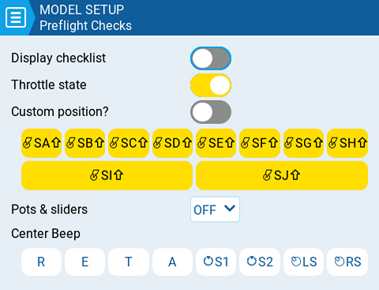

# Preflight Checks

<figure><figcaption>
Página de controles pre-vuelo
</figcaption></figure>

Cada vez que se carga un modelo nuevo, EdgeTX realiza un control pre-vuelo basado en las verificaciones definidas en esta página. Si falla alguna de las verificaciones, EdgeTX le dará al usuario una advertencia visual y audible que debe ser admitida antes de seguir adelante. Se pueden configurar las siguientes opciones:

**Display checklist (mostrar lista de verificaciones)** - Cuando está seleccionada esta opción, se mostrarán en pantalla las notas del modelo cuando este sea cargado. Debe existir un archivo válido en la carpeta **Models** en la tarjeta SD. El archivo de notas debe ser un archivo de texto .txt y debe tener exactamente el mismo nombre que el modelo seleccionado. Por ejemplo: Mobula6.txt. El texto en el archivo depende del usuario.

**Throttle state (estado del acelerador)** - Cuando está seleccionada esta opción, la radio verificará que el acelerador esté en su valor mínimo para la fuente configurada como acelerador en la sección [Throttle (acelerador)](throttle.md).

**Custom Position? (¿posición personalizada?)** - Si se seleciona esta opción, se mostrará una casilla con un número que puede ser definido como el valor mínimo para la verificación del estado del acelerador. &#x20;

**Switches (interruptores)** - Esta sección muestra todos los interruptores que están configurados en la radio y permite seleccionar cual es la posición en la que debe estar cada uno para la verificación pre-vuelo. Seleccionando un interruptor se podrá definir cual es la posición deseada o también desactivar la verificación del mismo. Los interruptores con fondo color amarillo, tienen la verificación activa y los blancos no.

**Pots & Sliders (perillas y deslizantes)**- Si está activada esta opción, se verificará también la posición de estos controles. Existen tres opciones - OFF (desactivado), ON (activado) and AUTO (automático). Al seleccioar las opciones ON o AUTO aparecerán botones para las perillas y deslizantes.&#x20;

* **OFF (desactivado)** - Las posiciones de las perillas y deslizantes no son verificadas.
* **ON (activado)** - Las posiciones son verificadas en relación a la posición configurada en forma manual.  Para definir manualmente la posición de verificación, seleccionar ON en el menú desplegable, poner las perillas y los deslizantes en la posición deseada y activarlos seleccionandolos (fondo amarillo).
* **AUTO (automático)** - Las posiciones son verificadas, haciendo una comparación, con las posiciones guardadas en forma automática, antes de apagar la radio o cambiar el modelo.

**Center Beep (bip en el centro)** - Permite activar (fondo amarillo) o desactivar (fondo blanco), la emisión de un bip, cuando los controles definidos (palancas, perillas, deslizantes) se encuentran en su posición central.&#x20;
