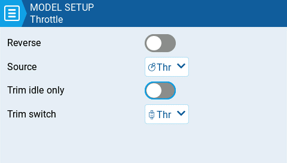

# Throttle

<figure><figcaption>
Página de configuración del acelerador
</figcaption></figure>

EdgeTX tiene la posibilidad de seleccionar una fuente específica y un trim (centrador) para el acelerador. Estas son las opciones de configuración:

**Reverse (invertido):** Cuando esta opción está habilitada, se invierte la salida del acelerador en el canal correspondiente.

**Source (fuente):** La fuente que será usada para el acelerador.&#x20;

**Trim idle only (centrador para ralenti solamente ):** Cuando está habilitado, el trim solo afecta la parte baja del acelerador.&#x20;


Por ejemplo, con **Trim idle only** habilitado, la palanca del acelerador en su punto más bajo, podría tener un valor de -80, en el punto central seguirá teniendo un valor de 0 y en el punto más alto 100. Sin esta función habilitada, la palanca del acelerador en su punto más bajo, podría tener un valor de -80, sin embargo, en el punto central valdrá 20 y en el punto más alto valdrá 100.&#x20;


**Trim switch (interruptor de centrado):** Define el interruptor de centrado que será usado para el acelerador. Es posible sustituir el interruptor de centrado del acelerador, por el de los alerones, timón o elevador.
