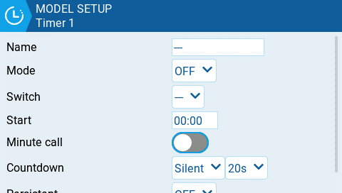

# Timer 1/2/3

<figure><figcaption>
Página de configuración del Timer
</figcaption></figure>

EdgeTX provee 3 timers que pueden ser programados por el usuario. Estas son las opciones de configuración:

**Name:**  Nombre del timer.

**Mode**:

* **OFF**- No se usa el timer.
* **ON** - El timer funciona continuamente.
* **Start (comienzo)** - El timer comienza a funcionar una vez que se ha activado el interruptor definido. Luego de que arrancó el timer la posición del interruptor es ignorada.
* **Throttle (acelerador)** - El timer comienza a contar, una vez que el acelerador es subido y se activa el interruptor asignado. Se detendrá la cuenta si el acelerador vuelve a su valor mínimo o se desactiva el interruptor.
* **Throttle % (% acelerador)** - El timer cuenta de manera proporcional al acelerador. Cuenta en tiempo real a máximo acelerador y a la mitad de velocidad si el acelerador está al 50%.
* **Throttle Start (arranque por acelerador)** - El timer comienza a contar una vez que se sube el acelerador y se activa el interruptor definido. Una vez que el timer arrancó, continuará funcionando, ignorando la posición del acelerador y solo deteniéndose si se desactiva el interruptor.


**Throttle**, **Throttle %**, y **Throttle Start** pueden ser disparados por un interruptor, una perilla o cualquier otro canal en lugar de solamente el acelerador. Esto se define en el campo **Source (fuente)** de [throttle.md](throttle.md "mention") section in **Model Setup (ajustes del modelo)**


**Switch- (interruptor)** Selecciona el interruptor que disparará el arranque del timer. Si no se selecciona ningún interruptor, el timer se disparará basado solamente en el modo configurado. Adicionalmente al interruptor, también se puede seleccionar un trim, una fuente de telemetría (arranque cuando se reciben datos de telemetría desde esta fuente), o una actividad física ( movimiento de una palanca o presión de un botón) (etiquetado como **ACT**)


Si el ítem tiene un signo "!" delante del nombre, significa que la condición es inversa. Por ejemplo, "!SA-" significa que se activará cuando el interruptor SA no esté en la posición media o central. Es decir cuando esté arriba o abajo.


**Start- (comienzo)** El tiempo usado para las funciones avanzadas del timer. El valor por defecto es 00:00 y en este caso el timer opera como un cronómetro, contando en forma ascendente hasta que se detenga. Si se ingresa un tiempo distinto en la casilla, aparecerá la opción **Direction (dirección)**.

**Direction (dirección)** - Si se configura como **Show Remaining (mostrar el tiempo restante)**, contará hacia atrás mostrando el tiempo faltante para llegar a cero y emitiendo una alerta al llegar. Si se configuró como **Show Elapsed (mostrar el tiempo transcurrido)**, contará de forma ascendente desde cero y hasta llegar al tiempo designado, alertando entonces al usuario.

**Minute Call (alerta de minuto)** - Si se selecciona esta opción, emitirá una notificación, cada minuto transcurrido como se haya configurado en **Count Down (cuenta descendente)**.

**Count Down (cuenta descendente):**

* **Silent (silencio)** - No se emitirá ninguna notificación hasta que el timer llegue a cero. Al llegar a cero emitirá un bip.
* **Beeps (bips)** - El timer emitirá un bip cada segundo comenzando en el tiempo definido.
* **Voice (voz)** - La radio hará una cuenta regresiva cada segundo, comenzando en el tiempo definido.
* **Haptic (vibración)** - La radio vibrará cada segundo, comenzando en el tiempo definido.
* **Beeps & Haptic (bip y vibración)** - La radio emitirá un bip y vibrará cada segundo, comenzando en el tiempo definido.
* **Voice & Haptic (voz y vibración)** - La radio hará una cuenta regresiva y vibrará cada segundo, comenzando en el tiempo definido.

**Persistent (persistente):**

* **Off (desactivado)** - El valor del timer, se reinicializará al cambiar de modelo o al apagar y encender la radio.
* **Flight (vuelo)** - El valor del timer no se reinicia al cambiar modelos ni al apagar y encender la radio. Se reinicia cuando se selecciona la opción **Reset flight** en el menú [Reset telemetry ](../../reset-telemetry.md).
* **Manual Reset (reinicio manual)** El valor del timer se reinicia solamente cuando se selecciona individualmente para ser reiniciado (ejemplo: Reset timer1) en el menú [Reset telemetry ](../../reset-telemetry.md).


La opción **Flight (vuelo)** puede configurarse para múltiples timers y estos pueden ser reiniciados simultaneamente con la opción **Reset flight**.


