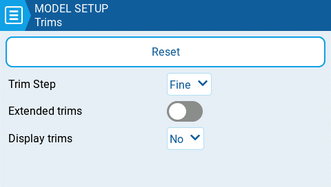

# Trims

<figure><figcaption>
Página de configuración de los Trims (centradores)
</figcaption></figure>

La función de los Trims (centradores), es ajustar la posición central de las palancas. EdgeTX tiene las siguilentes opciones de configuración:

**Reset (reinicio)** - Reinicio de todos los trims (centradores) a cero.

**Trim Step (pasos del centrador):** Define cuanto incrementa o decrementa el valor del trim (centrador) cada vez que se presiona.&#x20;

* Course (grueso) = 1.6%
* Medium (medio)= 0.8%
* Fine (fino)= 0.4%
* Extra Fine (muy fino) = 0.2%
* Exponential (exponencial) = 0.2% cerca del centro y luego aumenta exponencialmente al alejarse del centro.

**Extended Trims (centradores extendidos)**: Incrementa el valór máximo que puede ajustarse con el trim (centrador) desde **±**25% hasta **±**100%.


Cuando se cambia de extended trims (centradores extendidos) a normal trims (centradores normales), el valor del trim (centrador) permanecerá hasta que el propio trim (centrador) sea ajustado, luego saltará a los valores normales de mínimo y máximo.


**Display trims (mostrar centradores):** Esta opción permite mostrar el valor numérico del trim (centrador) en la barra de trims (centradores) de la pantalla. Las opciones son:

* **No (No) -** No muestra los valores numéricos en la pantalla.
* **Yes (Si) -** Muestra los valores numéricos si son distintos de cero.
* **Change (Cambia) -** Muestra el valor numérico durante 2 segundos si es distinto de cero.
