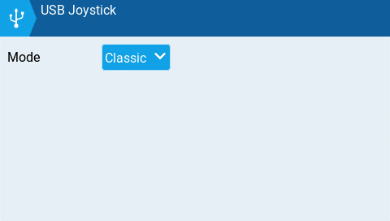
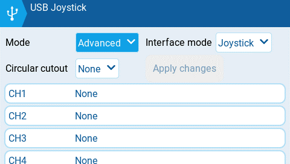
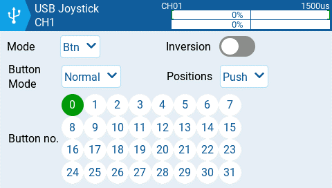
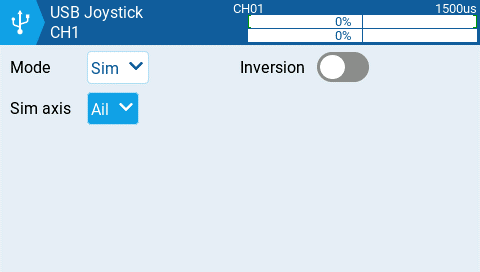

# USB Joystick

El mando USB (Joystick) tiene dos modos posibles, **Classic (clásico)** y **Advanced (avanzado)**.&#x20;

<figure><figcaption>
mando USB (Joystick) modo clásico
</figcaption></figure>

En **Classic mode (modo clásico)**, las salidas de los canales de la radio serán enviadas al computador en orden numérico y mapeadas a los ejes y botones preconfigurados en el controlador USB. A continuación, el mapeo por defecto de los canales para Microsoft Windows.

* Ch1 - eje X
* Ch 2 - eje Y
* Ch 3 - eje Z
* Ch4 - rotación X
* Ch 5 - rotación Y
* Ch 6 - rotación Z
* Ch 7 - Dial
* Ch 8 - deslizador
* CH 9 - Ch 32 - botones 1 - 24

<figure><figcaption>
mando USB (Joystick) modo avanzado
</figcaption></figure>

En **Advanced mode (modo avanzado)** se pueden configurar las siguientes opciones:

**Interface mode:** Esto le indica al dispositivo al que está conectado, que tipo de dispositivo se está conectando. Las opciones son **Joystick**, **Gamepad**, **MultiAxis.** &#x20;


**Nota:** Actualmente hay una limitación en MS Windows que puede limitar su transmisor, a ser detectado solamente como Joystick, independientemente de lo que se haya seleccionado en esta opción. En MacOS, Linux y Andriod esta función trabaja apropiadamente.


**Circular cutout (delimitación circular)**: Para los pares de ejes (X-Y, Z-rX): Por defecto, el rango de valores, cubre un area rectangular. Con esta opción habilitada, el rango de valores se limitará a un area circular. (como es común en los gamepad). Las opciones son: **None (ninguna)** o **X-Y, Z-rX** o **X-Y, Rx-Ry**

**Output channels (canales de salida) 1-32**

**Mode**: Se puede seleccionar el modo para cada canal. Las opciones disponibles son **None (ninguno)**, **Btn**, **Axis**, **Sim**.

**None (ninguno)** - Este canal no se usa.

<figure><figcaption>
Opciones del botón Mode para un canal seleccionado (CH1)
</figcaption></figure>

**Btn** - El canal es usado para simular un botón. Las opciones de configuración son:

* **Inversion** - Invierte la señal de salida del canal. Las opciones son: **On (invertido)** / **Off (normal)**
* **Button Mode** -
  * **Normal** - Cada posición de un interruptor de varias posiciones, se representa como un botón. Una posición del interruptor se representa como una presión continua de un botón.
  * **Pulse** - Similar al modo "Normal". Pero en lugar de una presión continua se representa como una pulsación corta del botón.
  * **SWEmu** - El interruptor de palanca, emula un interruptor de botón. La primera pulsación torna el botón virtual en activado (ON), la segunda lo torna desactivado (OFF).
  * **Delta** - Los cambios en el canal de salida, se representan como 2 botones. Cuando decrece el valor de salida, el primer botón es presionado, Cuando se incrementa el valor de salida, el segundo botón es presionado. Si no hay cambios entonces se muestra como que ningún botón fue presionado.
  * **Companion** - Debe seleccionarse esta opción, cuando se usa el transmisor para controlar el simulador en EdgeTX Companion. Esto permite que los interruptores multi-posición, funciones de manera apropiada en el simulador.
* **Positions** - El tipo de boton que será simulado.&#x20;
  * **Push -** Solamente se mapeará como un botón.
  * **2POS - 8 POS** - Se mapeará como el número de botones correspondientes a las posiciones del interruptor(ej: 3POS mapeará como 3 botones).
* **Button No:** El número de botón que será mapeado a la salida y enviado al computador.

<figure><figcaption>
modo Axis (ejes) para un canal seleccionado
</figcaption></figure>

**Axis -** El canal se usa para simular un eje y será mapeado a uno de los ejes por defecto del dispositivo conectado.

* Las opciones para Axis son: X, Y, Z, rotX (rotación de x), rotY, rotZ

<figure><figcaption>
opciones del modo Sim para el canal seleccionado
</figcaption></figure>

**Sim -** El canal es usado para simular un eje común simulado y será listado en el dispositivo de destino como la opción seleccionada (ejemplo: acelerador (Thr))

* Las opciones para Sim axis son: **Ail**, **Ele**, **Rud**, **Thr**
