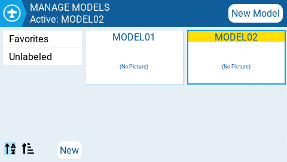
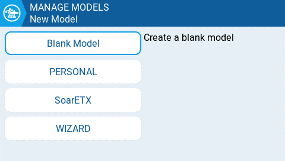
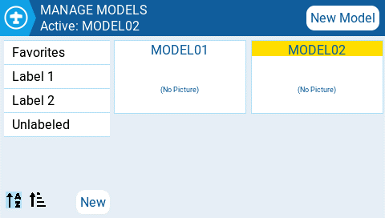
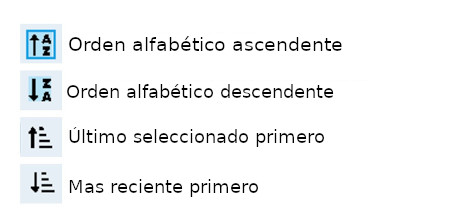

# Administrar Modelos

En la pantalla de administración de modelos "MANAGE MODELS" se pueden crear nuevos modelos, seleccionar cual estará activo, crear nuevos, aplicarles etiquetas y crear plantillas.

<figure><figcaption>
Pantalla de administración de modelos
</figcaption></figure>

### Selección y administración de modelos existentes&#x20;

El nombre del modelo activo se verá destacado (amarillo en la imagen de muestra), y también se mostrará en la barra superior de la pantalla. Pulsando sobre el modelo activo, nos dará las siguientes opciones:

* **Duplicate model** - Esta opción crea un duplicado exacto del modelo con el mismo nombre. Para cambiar el nombre del modelo u otros ajustes, es necesario ir a la pestaña de configuración [Configuración del modelo ](model-settings/).
* **Label Model** - Al seleccionar esta opción, se mostrarán todas las etiquetas y podrán ser asignadas a este modelo. Ver [Etiquetas de modelos](select-model.md#etiquetas-de-modelos) mas abajo.&#x20;
* **Save as template** - Esta opción guarda una copia del modelo como plantilla de base para otros modelos.


Los cambios echos a modelos que se han guardado como plantilla, no afectan a las plantillas en si.


Al presionar dos veces seguidas, sobre un modelo que no está activo (no destacado), se abrirán las siguientes opciones:

* **Select model** - Esta opción selecciona el modelo como activo.
* **Duplicate model** - Esta opción crea un duplicado exacto del modelo con el mismo nombre. Para cambiar el nombre del modelo u otros ajustes, es necesario ir a la pestaña de configuración [Configuración del modelo ](model-settings/).
* **Delete model** - Borra el modelo moviéndolo a la carpeta "deleted" en la tarjeta SD. _Solo se puede borrar el modelo si no está activo._
* **Label model** - Al seleccionar esta opción, se mostrarán todas las etiquetas y podrán ser asignadas a este modelo. Ver [Etiquetas de modelos](select-model.md#etiquetas-de-modelos) mas abajo.&#x20;
* **Save as template** - Esta opción guarda una copia del modelo como plantilla de base para otros modelos.

### Creación de un modelo nuevo

Para crear un modelo nuevo, se debe seleccionar el botón **New Model** en la esquina superior izquierda. Aparecerán las siguientes opciones:&#x20;

<figure><figcaption>
Opciones para modelo nuevo
</figcaption></figure>

* **Blank Model** - Se creará un modelo nuevo en blanco, con las opciones configuradas por defecto.
* **PERSONAL** - Esta opción permite seleccionar una plantilla y crear una copia como modelo nuevo.
* **SoarETX** - Esta opción permite seleccionar una plantilla preconfigurada de fábrica, para planeadores.
* **WIZARD** - Esta opción lanza el asistente de configuración para un nuevo modelo.

### Etiquetas de modelos

Pueden asignarse a cada modelo una o mas etiquetas. Esto permite filtrar la búsqueda de un modelo, basándose en las etiquetas seleccionadas. Facilitando la selección cuando se han configurado muchos modelos. Por defecto vienen creadas de fábrica las etiquetas (Favoritos) **Favorites** y (sin etiqueta) **Unlabeled**. Todos los modelos se consideran (sin etiqueta) **unlabeled** mientras no tengan ninguna asigada.

<figure><figcaption>
Filtrado y ordenamiento de los modelos por sus etiquetas
</figcaption></figure>

### Filtrado de los modelos usando sus etiquetas

Para filtrar los modelos en base a sus etiquetas. Se deben seleccionar la o las etiquetas de filtro en la columna izquierda. Esto quitará de la pantalla, todos los modelos que no tengan estas etiquetas.

### Asignación de etiquetas a los modelos

Para asignar una etiqueta a un modelo. Se debe presionar dos veces sobre el mismo o presionar el rodillo cuando el modelo ya está seleccionado. Luego seleccionar **Label Model**. Se mostrarán todas la etiquetas disponibles, permitiendo la selección de una o mas. Las etiquetas seleccionadas se mostrarán con un _**tilde**_.

### Creación de etiquetas nuevas

Para crear una etiqueta nueva, se debe seleccionar el botón **New** abajo a la derecha de la pantalla. Se mostrará el menú **Enter Label** donde se puede ingresar el nombre para la etiqueta. Con **Save** se guarda la nueva etiqueta y con **Cancel** se cancela la operación.

### Edición de etiquetas

Manteniendo presionado el rodillo o manteniendo la presión del dedo sobre la etiqueta deseada. Se mostrará un menú con las siguientes opciones:

* Rename Label - Cambia el nombre de la etiqueta.
* Delete Label - Borra la etiqueta de la lista y de todos los modelos que la tengan asignada.&#x20;
* Move Up - Posiciona la etiqueta mas arriba en la lista.&#x20;
* Move Down - Posiciona la etiqueta mas abajo en la lista.

### Orden de los modelos

Los íconos debajo de la lista de etiquetas, sirven para ordenar el listado de modelos. Estos pueden ser ordenados alfabéticamente o por la última vez que fueron seleccionados.

<figure><figcaption>
 Orden definida por los íconos
</figcaption></figure>

