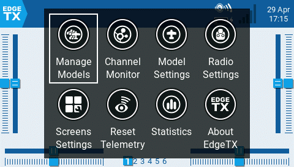

# Interfaz de usuario

La pantalla de la radio con EdgeTX, se puede navegar mediante el uso de los botones, tocando la pantalla o una combinación de ambos.

<figure><figcaption>
Botones usados para la navegación:
</figcaption></figure>

### **Botones:**

*   **\[SYS]** - Botón de acceso al sistema\
    \- Presionando brevemente el botón **\[SYS]** vamos a la página de ajustes de la radio [Radio Settings](radio-settings/)
    \
    \- Manteniendo presionado el botón **\[SYS]** vamos a la página de configuración [Radio Setup](radio-settings/radio-setup/)

* **\[MDL]** - Botón de acceso al modelo\
  \- Presionando brevemente el botón **\[MDL]** vamos a la página de ajustes del modelo [Model Settings](model-settings/)\
  \- Manteniendo presionado el botón **\[MDL]** vamos a la página de selección del modelo [Select Model](select-model.md) 
* **\[RTN] -** Botón de retorno \
  \- Presionando brevemente el botón **\[RTN]** retornamos a la página previa, al menú previo o cancelamos una acción
* **\[PAGE>] / \[PAGE<]** - Próxima página y página previa\
  \- Se usa para navegar entre las diferentes pantallas, pestañas u opciones, dependiendo de la pantalla en que nos encontremos.
* **\[TELE] -** Telemetría \
  \- Presionando el botón **\[TELE]** vamos a la pantalla de configuración de las opciones de telemetría [Screen Settings](screen-settings/) 
* **\[Roller]** or **\[Dial] -** Rodillo \
  \- Girando el rodillo, cambia los valores seleccionados\
  \- También se usa el rodillo para navegar por las distintas opciones del menú. &#x20;
* **\[Enter]** - Aceptar \
  \- Presionando el rodillo se puede seleccionar una opción, una función o aceptar un valor\
  
### **Interfaz Táctil**:

Ciertas radios están equipadas con una pantalla táctil. En estas radios, se puede interactuar con el menú, ya sea tocando la pantalla o usando los botones.&#x20;


Es possible deshabilitar la interfaz táctil, configurando una función especial. Ver Funciones especiales [special-functions.md](model-settings/special-functions.md "mention") para mas información.


Tocando el ícono EdgeTX en la esquina superior izquierda de la pantalla, se abre el menú de navegación principal. Tocando la opción deseada del menú, esta se seleccionará.

<figure><figcaption>
 Menú de navegación principal
</figcaption></figure>


En los modelos que tienen habilitada la función Lista de verificación, **Display Checklist**, en la pantalla de chequeo prevuelo [Preflight Checks](model-settings/model-setup/preflight-checks.md) y un archivo de chequeo de un modelo válido en la carpeta **Models** aparecerá el ícono **Model Notes** en lugar del ícono **Channel Monitor**.


Si se presiona el rodillo estando en la pantalla principal, Se abrirá el menú de navegación principal. Luego se puede recorrer el menú usando el rodillo y hacer la selección presionando el mismo.
